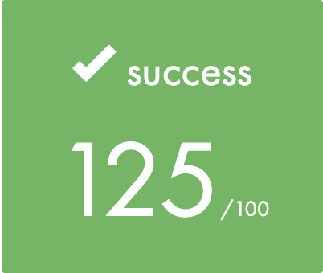

# Libft-42Quebec

## Subject

<a href="https://www.mangaupdates.com/](https://github.com/yanislabbe/Libft-42Quebec/blob/main/requirement/Libft-Subject-FR-42Quebec.pdf">Subject</a>

## Usage

``make`` without bonus features.

``make bonus`` to compile with bonuses.

## Results

	

